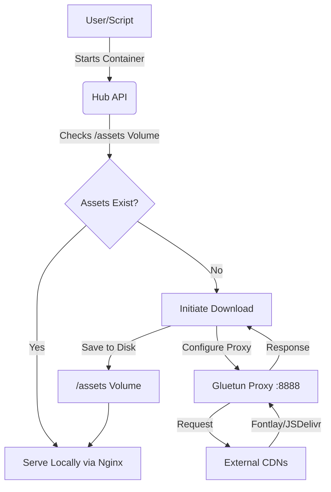

# 🛡️ ZimaOS Privacy Hub

A comprehensive, self-hosted privacy infrastructure designed for digital independence.
Route your traffic through secure VPNs, eliminate tracking with isolated frontends, and manage everything from a unified **Material Design 3** dashboard.

## 🌟 Key Features

*   **VPN-Gated Frontends**: Services like Invidious (YouTube), Redlib (Reddit), and Wikiless are routed through a **Gluetun VPN** tunnel. Upstream providers see your VPN IP, not your home IP.
*   **Zero-Leaks Architecture**: No external CDNs or trackers. All assets (fonts, icons, scripts) are fetched once via an anonymized proxy and served locally.
*   **Network-Wide Filtering**: AdGuard Home provides DNS-level ad blocking and tracking protection for your entire home network.
*   **Automated Lifecycle**: Built-in "Update Engine" handles backups, database migrations, container rebuilds, and rollbacks automatically.
*   **Material Design 3**: A modern, responsive management dashboard with dynamic theming and real-time system metrics.
*   **Hardened Infrastructure**: Built on DHI (Docker Hardened Images) with minimal-footprint Alpine Linux bases.

## 📚 Contents
- [🚀 Quick Start](#quick-start)
- [🖥️ Management Dashboard](#management-dashboard)
- [📦 Included Services](#included-services)
- [🔗 Service Access](#service-access-after-deploy)
- [🔧 Add Your Own Services](#add-your-own-services)
- [🌐 Network Configuration](#network-configuration)
- [📡 Advanced Setup: OpenWrt & Double NAT](#advanced-setup-openwrt--double-nat)
- [🔒 Security & Credentials](#security--credentials)

## 🏗️ Getting Started

### Prerequisites & Credentials
Prepare these ahead of time to ensure a smooth deployment.

*   **Docker Hub / DHI Access**: A username and Personal Access Token (PAT) with `read` permissions is required to pull hardened images and avoid rate limits.
    *   *Create at:* [Docker Hub Security Settings](https://hub.docker.com/settings/security)
*   **WireGuard Configuration**: A `.conf` file from your VPN provider (e.g., ProtonVPN, Mullvad) to enable the privacy tunnel.
    *   *Note:* Only ProtonVPN is explicitly tested. Ensure "Port Forwarding" is enabled if supported by your provider.
*   **deSEC Domain (Recommended)**: A free domain and API token from [deSEC.io](https://desec.io) enables trusted SSL certificates and automated Dynamic DNS (DDNS).
*   **GitHub Token (Optional)**: A classic PAT with `gist` scope is required for the **Scribe** service to function.
*   **Odido OAuth token (optional, NL unlimited data)**: Used by Odido Booster. Get the OAuth token using [Odido Authenticator](https://github.com/GuusBackup/Odido.Authenticator).

### Key Concepts & Terms
*   **DHI (Docker Hardened Images)**: Custom images (hosted at `dhi.io`) optimized for security by reducing the attack surface and using minimal base OS components.
*   **DDNS (Dynamic DNS)**: Automatically synchronization of your domain name with your home's public IP. Essential if your ISP gives you a dynamic IP that changes periodically.
*   **SSL (Secure Sockets Layer)**: Encrypts the connection between your browser and the hub. We use **Let's Encrypt** for globally trusted certificates (no security warnings).
*   **PAT (Personal Access Token)**: A secure alternative to passwords for API access (like Docker Hub or GitHub).
*   **Gluetun**: The VPN gateway container. It acts as a "firewall" that only allows traffic to flow through the encrypted VPN tunnel.

<details>
<summary><strong>ProtonVPN WireGuard (.conf) - tested path</strong></summary>

Only ProtonVPN is tested; other providers might work but are unverified. 

1. Go to **Downloads → WireGuard configuration**.
2. Enable **Port Forwarding** before creating the config.
3. Give the config a recognizable **name**.
4. Choose a server/region and download the `.conf`.
5. Paste the contents when the script prompts for the WireGuard configuration.

</details>

### Installation
Run the deployment script. It will validate your environment, prompt for credentials, and build the stack.

```bash
# Standard Deployment (Interactive)
./zima.sh

# Deployment with Auto-generated Passwords (Recommended for Beginners)
./zima.sh -p
```

### 🔑 Post-Install: Where are my passwords?
If you used the `-p` flag, the script auto-generated secure credentials for you.

1.  **Secret File**: All passwords are stored on your host at:
    ```bash
    /DATA/AppData/privacy-hub/.secrets
    ```
    > ⚠️ **SECURITY WARNING**: This file contains unencrypted administrative passwords and API keys. Ensure access to your host machine is restricted.

2.  **Proton Pass Import**: A CSV file ready for import into password managers is generated at:
    ```bash
    /DATA/AppData/privacy-hub/protonpass_import.csv
    ```
3.  **Default Username**:
    *   **Portainer**: `portainer` (or `admin`)
    *   **AdGuard**: `adguard`
    *   **Dashboard API**: `HUB_API_KEY` (Found in `.secrets`)

### Management & Troubleshooting
*   **Update Services**: Use the "Check Updates" button in the dashboard.
*   **Restart Stack**: `./zima.sh` (Running it again updates configuration and restarts containers safely).

| Flag | Description | Action |
| :--- | :--- | :--- |
| `-c` | **Clean Reset** | Removes all containers and networks but preserves user data. Useful for fixing network glitches. |
| `-x` | **Uninstall** | ⚠️ **DESTRUCTIVE**. Removes containers, networks, volumes, and ALL data. |
| `-p` | **Auto-Passwords** | Generates secure random passwords for all services automatically. |
| `-y` | **Auto-Confirm** | Skips confirmation prompts (for automated deployments). |
| `-s` | **Select Services** | Deploy specific services only (e.g., `./zima.sh -s invidious,memos`). |

## 🖥️ Management Dashboard

Access the unified dashboard at `http://<LAN_IP>:8081`.

### Material Design 3 Compliance
The dashboard is built to strictly follow **[Google's Material Design 3](https://m3.material.io/)** guidelines.
*   **Color System**: We use the official `material-color-utilities` library to generate accessible color palettes from your seed color or wallpaper.
*   **Components**: All UI elements (cards, chips, buttons) adhere to M3 specifications for shape, elevation, and state layers.

### Customization
*   **Theme Engine**: Upload a wallpaper to automatically extract a coordinated palette (Android folder style), or pick a color manually.
*   **Presets**: Choose from curated Material Design color presets.
*   **Privacy Masking**: One-click toggle to blur sensitive IPs and data for screenshots.

### Update Engine
*   **Changelogs**: View commit logs (for source builds) or release notes (for images) directly in the UI.
*   **Granular Control**: Update all services at once or select specific ones.
*   **Safety First**: Automatic database backups are created before any update is applied.

## 📦 Included Services

| Service | Category | Purpose | Source |
| :--- | :--- | :--- | :--- |
| **Invidious** | Frontend | Anonymous YouTube (No ads/tracking) | [iv-org/invidious](https://github.com/iv-org/invidious) |
| **Redlib** | Frontend | Lightweight Reddit interface | [redlib-org/redlib](https://github.com/redlib-org/redlib) |
| **Wikiless** | Frontend | Private Wikipedia access | [Metastem/Wikiless](https://github.com/Metastem/Wikiless) |
| **Memos** | Utility | Private knowledge base & notes | [usememos/memos](https://github.com/usememos/memos) |
| **AdGuard Home** | Core | DNS filtering & Ad-blocking | [AdguardTeam/AdGuardHome](https://github.com/AdguardTeam/AdGuardHome) |
| **WireGuard** | Core | Secure remote access gateway | [wg-easy/wg-easy](https://github.com/wg-easy/wg-easy) |
| **Portainer** | Admin | Advanced container management | [portainer/portainer](https://github.com/portainer/portainer) |
| **VERT** | Utility | Local, GPU-accelerated file conversion | [VERT-sh/vert](https://github.com/vert-sh/vert) |
| **Rimgo** | Frontend | Lightweight Imgur interface | [rimgo/rimgo](https://codeberg.org/rimgo/rimgo) |
| **BreezeWiki** | Frontend | De-fandomized Wiki interface | [cadence/breezewiki](https://gitdab.com/cadence/breezewiki) |
| **AnonOverflow** | Frontend | Private Stack Overflow viewer | [httpjamesm/anonymousoverflow](https://github.com/httpjamesm/anonymousoverflow) |
| **Scribe** | Frontend | Alternative Medium frontend | [scribe](https://git.sr.ht/~edwardloveall/scribe) |
| **Odido Booster** | Utility | Automated NL data bundle booster | [Lyceris-chan/odido-bundle-booster](https://github.com/Lyceris-chan/odido-bundle-booster) |

> 💡 **Tip: Migrating your data to Invidious**
> You can easily import your existing data to your private Invidious instance. Navigate to **Settings → Import/Export** to upload:
> *   **Invidious Data**: JSON backup from another instance.
> *   **YouTube**: Subscriptions (CSV/OPML), Playlists (CSV), or Watch History (JSON).
> *   **Other Clients**: FreeTube (`.db`) or NewPipe (`.json`/`.zip`) subscriptions and data.

## 🔗 Service Access (After Deploy)

The dashboard provides one-click launch cards for every service. When deSEC is configured, HTTPS URLs are available at `https://<service>.<domain>:8443/`.

| Service | Local URL | HTTPS (deSEC) |
| :--- | :--- | :--- |
| Dashboard | `http://<LAN_IP>:8081` | `https://<domain>:8443/` |
| Invidious | `http://<LAN_IP>:3000` | `https://invidious.<domain>:8443/` |
| Redlib | `http://<LAN_IP>:8080` | `https://redlib.<domain>:8443/` |
| Wikiless | `http://<LAN_IP>:8180` | `https://wikiless.<domain>:8443/` |
| AdGuard Home | `http://<LAN_IP>:8083` | `https://adguard.<domain>:8443/` |
| WireGuard UI | `http://<LAN_IP>:51821` | `https://wireguard.<domain>:8443/` |
| Portainer | `http://<LAN_IP>:9000` | `https://portainer.<domain>:8443/` |

<a id="add-your-own-services"></a>
<details>
<summary><strong>🔧 Add Your Own Services</strong> (advanced)</summary>

### 1) Service Definition (Orchestration Layer)
Locate **SECTION 13** in `zima.sh` (search for `# --- SECTION 13: ORCHESTRATION LAYER`). Add your service block using the `should_deploy` check to enable selective deployment.

```bash
if should_deploy "myservice"; then
cat >> "$COMPOSE_FILE" <<EOF
  myservice:
    image: my-image:latest
    container_name: myservice
    networks: [frontnet]
    # For VPN routing, uncomment the next two lines:
    # network_mode: "service:gluetun"
    # depends_on: gluetun: {condition: service_healthy}
    restart: unless-stopped
EOF
fi
```

### 2) Monitoring & Health (Status Logic)
Update the service status loop inside the `WG_API_SCRIPT` heredoc in `zima.sh` (search for `Check individual privacy services status internally`).

- Add `"myservice:1234"` to the `for srv in ...` list.
- If the service is routed through Gluetun, add `myservice` to the case that maps `TARGET_HOST="gluetun"`.

### 3) Dashboard UI
Add a card in the dashboard HTML (SECTION 14 in `zima.sh`). Use `id="link-myservice"` and `data-container="myservice"`.

</details>

## 🖥️ System Requirements

| Specification | Minimum | Recommended |
| :--- | :--- | :--- |
| **Processor** | 2 Physical Cores | 4+ Physical Cores (8+ Threads) |
| **RAM** | 4 GB | 8 GB+ |
| **OS** | Linux (Ubuntu/Debian/Alpine) | Linux (Ubuntu/Debian/Alpine) |

The configuration is pre-tuned to support up to **30 users** on a machine with 16 GB RAM. Each service is constrained by **Docker Resource Limits** to prevent host exhaustion.

## 🌐 Network Configuration

### 1. Standard Router Setup (Recommended)
Set your router's **LAN DNS** to the local IP of your Privacy Hub (e.g., `192.168.1.100`). This ensures all devices on your network automatically use AdGuard Home for filtering.

### 2. Manual Device Configuration
If you cannot change router settings, manually set the DNS server in your device's Network Settings to the Privacy Hub's IP. 

### 3. Advanced Setup (OpenWrt / Hijacking)
Some devices hardcode DNS (like `8.8.8.8`) to bypass filters. You can force compliance using **DNS Hijacking** (NAT Redirection).

**OpenWrt UCI Commands:**
```bash
# 1. Static IP Assignment
uci add dhcp host
uci set dhcp.@host[-1].name='Privacy-Hub'
uci set dhcp.@host[-1].mac='00:11:22:33:44:55' # <--- YOUR MAC
uci set dhcp.@host[-1].ip='192.168.1.100'      # <--- YOUR IP
uci commit dhcp

# 2. DNS Hijacking (Redirect all LAN port 53 traffic to the Hub)
uci add firewall redirect
uci set firewall.@redirect[-1].name='Forced-DNS'
uci set firewall.@redirect[-1].src='lan'
uci set firewall.@redirect[-1].proto='tcpudp'
uci set firewall.@redirect[-1].src_dport='53'
uci set firewall.@redirect[-1].dest_ip='192.168.1.100'
uci set firewall.@redirect[-1].dest_port='53'
uci set firewall.@redirect[-1].target='DNAT'

# 3. Blocking Public DoH (Closing bypass holes)
# See OpenWrt 'banIP' or 'simple-adblock' documentation for blocking port 853.
```

**Resources:**
*   [OpenWrt: Intercepting DNS](https://openwrt.org/docs/guide-user/firewall/firewall_configuration/intercept_dns)
*   [OpenWrt: Ban IP addresses (DoH Blocking)](https://openwrt.org/docs/guide-user/firewall/firewall_configuration/ban_ip)

## 🔒 Security & Privacy

### Zero-Leaks Architecture
External assets (fonts, icons, scripts) are fetched once via the **Gluetun VPN proxy** and served locally. Your public home IP is never exposed to CDNs.



**Privacy Enforcement:**
1.  **Isolation**: The host machine never contacts CDNs directly.
2.  **Proxying**: The `hub-api` container uses the `gluetun` container as an HTTP proxy for all external fetches.
3.  **Data Minimization**: Requests use generic User-Agents, preventing host fingerprinting. Upstream providers see a generic Linux client from a VPN IP.

### Proton Pass Export
When using `-p`, a verified CSV is generated at `/DATA/AppData/privacy-hub/protonpass_import.csv` for easy import ([See Guide](#proton-pass-import)).

<a id="proton-pass-import"></a>
<details>
<summary><strong>👇 How to Import into Proton Pass</strong></summary>

1.  **Download the CSV**: Transfer `protonpass_import.csv` to your machine.
2.  **Open Proton Pass**: Settings → Import → Select Proton Pass (CSV).
3.  **Upload**: The format matches the official template (`name,url,email,username,password,note,totp,vault`).
</details>

---
*Built with ❤️ for the self-hosting community.*
